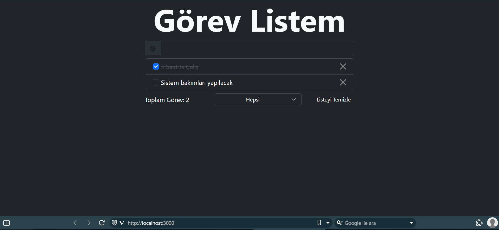

># Görev Listem
## Amaç
Kullanıcıdan almış olduğu girdileri dinamik olarak listelemek. Ayrıca bu tutulan girdileri yani görevleri tamamlanma veya tamamlanma'ma durumlarını göre ekrana filtreleme yapılması.
## Çalışmaya Ait Ekran Görüntüsü

## Gereksinimler:
- **NodeJs**
- **Herhangi bir tarayıcı**

Eleştiri ve öneriler için bu [mail](mailto:emirhan.yildizhan@outlook.com.tr) adresi üzerinden benimle iletişime geçiniz.
